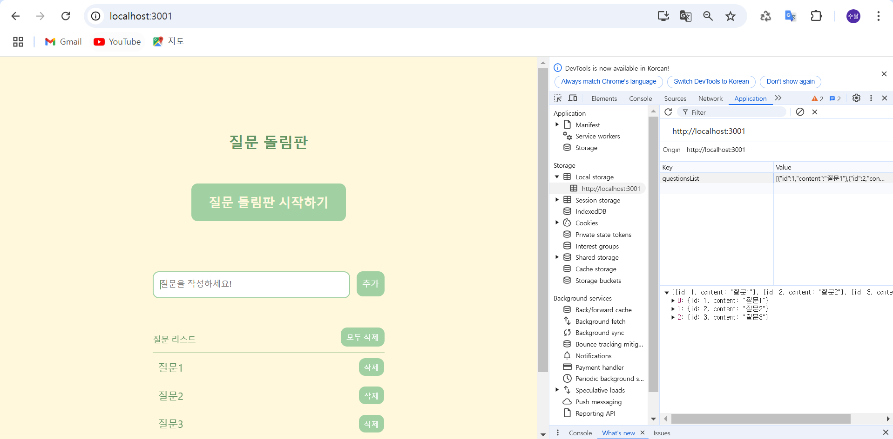
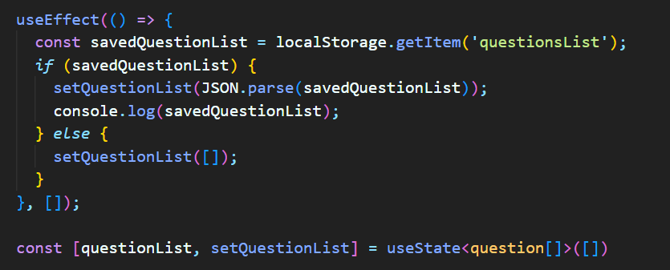
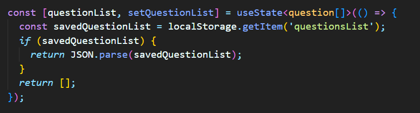
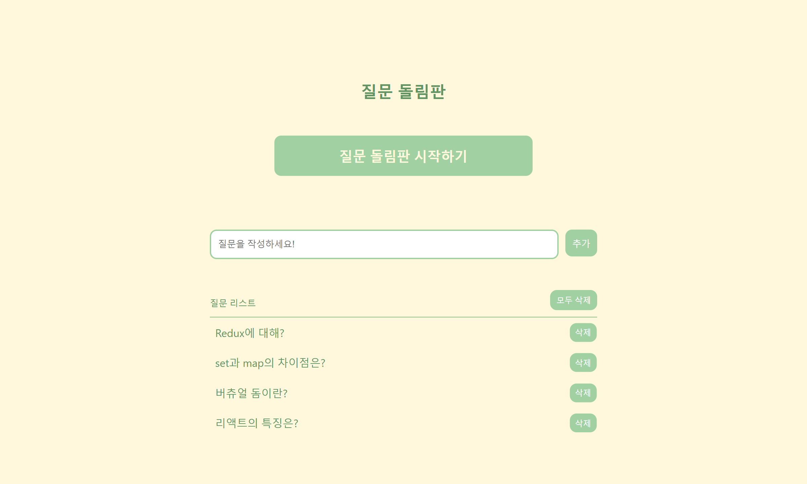
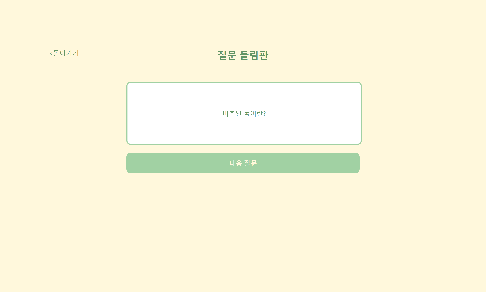

# 랜덤 질문 돌림판

## 프로젝트 소개

- 제작 기간 : 2024.11.08 ~ 11.14
- 참여 인원 : [@subin5874](https://github.com/subin5874)

- React와 TypeScript를 사용한 프론트엔드 프로젝트입니다.
- 질문을 작성할 수 있고, 질문을 랜덤으로 보여줍니다.
- localstorage에 질문 데이터를 저장합니다.

## 사용 기술

### Front-end

   

### 버전 관리 시스템

### 사용 툴

## 주요 기능

### 질문 추가/삭제 기능

- 질문을 추가/삭제가 가능합니다. 질문을 한번에 모두 삭제할 수 있습니다.

### 랜덤 질문 돌림판 기능

- 질문이 2개 이상일 때 질문을 랜덤으로 보여주는 기능이 있습니다.

### 질문 리스트 저장 기능

- localstorage에 질문 리스트를 저장하여 새로고침 시에도 유지되도록 하였습니다.

## 트러블슈팅

### 문제 : 새로고침 후 localstorage에 있는 데이터가 초기화됨

웹 페이지를 새로고침한 후, localstorage에 저장된 값이 초기화 되는 문제가 발생하였다.

### 원인 : useState로 상태를 초기화할 때 빈 배열로 설정

상태 초기화가 useState에서 이루어지기 때문에 useEffect가 실행되기 전에 questionList의 상태가 빈 배열로 설정되었고, 이로 인해 localstorage의 값이 반영되지 않았다.

### 해결 방법 : useState에 초기화 함수 사용

useEffect를 사용하지 않고, useState에 초기화 함수를 사용하여 localstorage에 저장된 데이터를 가져오도록 변경하였다.

### 결과 : 새로고침 후 localstorage의 데이터를 성공적으로 받아옴

새로고침 후에 localstorage에 저장된 데이터를 성공적으로 받아와 상태에 반영되었다.

### 학습한 점

useState 훅에서 초기값을 설정할 때 직접 할당하는 방법 말고도 초기화 함수를 사용할 수 있다는 점을 알게 되었다.

## 구현 화면

### 1) 메인 홈 페이지

### 2) 랜덤 질문 페이지

## 느낀점

CS 공부 및 면접을 준비하며 개념을 잘 알고 있는지 테스트를 하기 위해 만든 프로젝트입니다.  
TypeScript를 처음 사용해보며 어떻게 사용하는지 알 수 있었습니다.  
유동적인 언어인 Javascript가 런타임 시점에 동적으로 타입이 정해진다는 장점이 있는데 왜 타입을 미리 선언하는 Typescript를 사용할까? 의문점을 가지고 있었는데, 이번 프로젝트를 통해 이해할 수 있었습니다. Typescript는 미리 타입을 지정하여서 오류를 줄일 수 있고, Javascript는 코드 작성시에 편리하다는 차이점을 깨달을 수 있었습니다.

github의 branch를 활용하여 코드를 더욱 효율적으로 관리하였습니다.  
main, develop, feature 브랜치를 생성하였고, 기능 구현을 완료하면 Pull Request를 통해 검토 후 Merge 하도록 하였습니다.  
작은 수정사항도 commit하다보니 어떻게 코드를 작성하고 수정하였는지 알 수 있어서 편리하였습니다.
